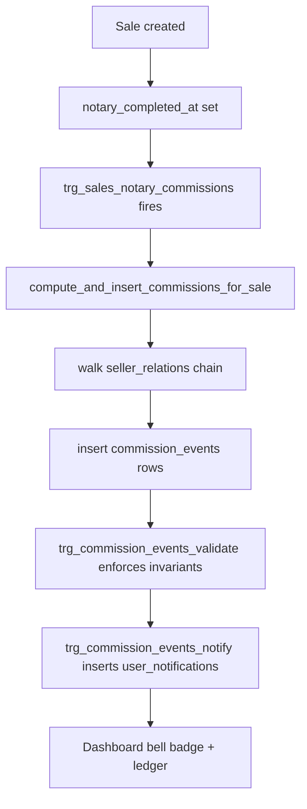

# Commission Architecture

Technical reference for the Zitouna commission engine. See also the
[Runbook](./COMMISSION_RUNBOOK.md) and the [QA Checklist](./COMMISSION_QA.md).

## 1. Overview

Zitouna pays ambassadors on each notarized sale using a two-tier model:

- **L1 (direct)** – the seller who closed the deal receives the L1 amount.
- **L2+ (indirect)** – the seller's upline (parrain, grand-parrain, ...) receives
  the L2, L3 ... amounts defined by the project's rule set.

Commissions are computed server-side the moment a sale reaches the notary
stage. The engine walks the parrainage chain, applies per-project rules, and
persists one `commission_events` row per beneficiary.

## 2. Data flow

## 3. Parrainage tree model

- `seller_relations(child_client_id, parent_client_id)` is the **canonical**
  upline graph. Every chain walk reads from here.
- `clients.referred_by_client_id` is the **legacy** column kept in sync for
  backward compatibility. Two mechanisms guarantee parity:
  - `zitouna_sales_auto_parrainage` – trigger on `sales` that materializes the
    edge whenever a buyer first appears in a sale.
  - `backfill_parrainage_from_sales()` – idempotent repair function invoked on
    every fresh `03_functions.sql` apply.

## 4. Commission rules

- Stored in `project_commission_rules(project_id, level, amount_tnd)`.
- Each project can override defaults; missing levels fall back to the seed.
- `seed_default_commission_rules()` inserts **L1 = 60, L2 = 20, L3 = 10 TND**
  whenever a project has no rules.
- Snapshots of the applied rules are copied onto `sales.commission_rule_snapshot`
  at notary time so retroactive edits never rewrite historical payouts.

## 5. Invariants enforced

The `trg_commission_events_validate` trigger rejects rows that violate:

- `UNIQUE(sale_id, beneficiary_client_id)` – one row per (sale, beneficiary).
- **L1 = seller only** – level 1 must reference the sale's seller.
- **L2+ != seller** – upline levels may never point at the seller.
- **Cycle-safe walk** – depth is capped at **40** hops to defuse bad data.

Any breach raises a `23514 check_violation`.

## 6. Cleanup path

`cleanup_inconsistent_commission_events()` runs as part of the fresh apply
(`03_functions.sql`) and:

1. Deletes events whose sale no longer matches the snapshot.
2. Drops duplicates per `(sale_id, beneficiary_client_id)`.
3. Re-invokes `compute_and_insert_commissions_for_sale` on affected sales.

Safe to re-run manually (`select cleanup_inconsistent_commission_events();`).

## 7. Key files

**SQL (`database/`)**

- `02_schema.sql` – tables `commission_events`, `project_commission_rules`,
  `seller_relations`, `user_notifications`.
- `03_functions.sql` – `compute_and_insert_commissions_for_sale`,
  `trg_sales_notary_commissions`, `trg_commission_events_validate`,
  `trg_commission_events_notify`, `zitouna_sales_auto_parrainage`,
  `backfill_parrainage_from_sales`, `seed_default_commission_rules`,
  `cleanup_inconsistent_commission_events`, `detect_parrainage_anomalies`.
- `04_rls.sql` – `client_select_own_commission_events`,
  `staff_commission_events_crud`.
- `05_seed.sql` – default levels.

**React (`src/admin/pages/`)**

- `CommissionTrackerPage.jsx` – `/admin/commissions`.
- `CommissionLedgerPage.jsx` – `/admin/commission-ledger`.
- `CommissionAnomaliesPage.jsx` – `/admin/commissions/anomalies`.
- `ReferralCommissionSettingsPage.jsx` – project rule editor.
- `FinanceDashboardPage.jsx` – `/admin/finance` analytics.

**Client & shared**

- `src/lib/useSupabase.js` – `useAmbassadorReferralSummary`.
- `src/lib/db.js` – `overrideSaleCommissionSnapshot`.
- `src/components/NotificationsMenu.jsx` – bell/badge.
- `src/pages/DashboardPage.jsx` – ambassador ledger card.
- CSS: `commission-tracker.css`, `finance-dashboard.css`.
